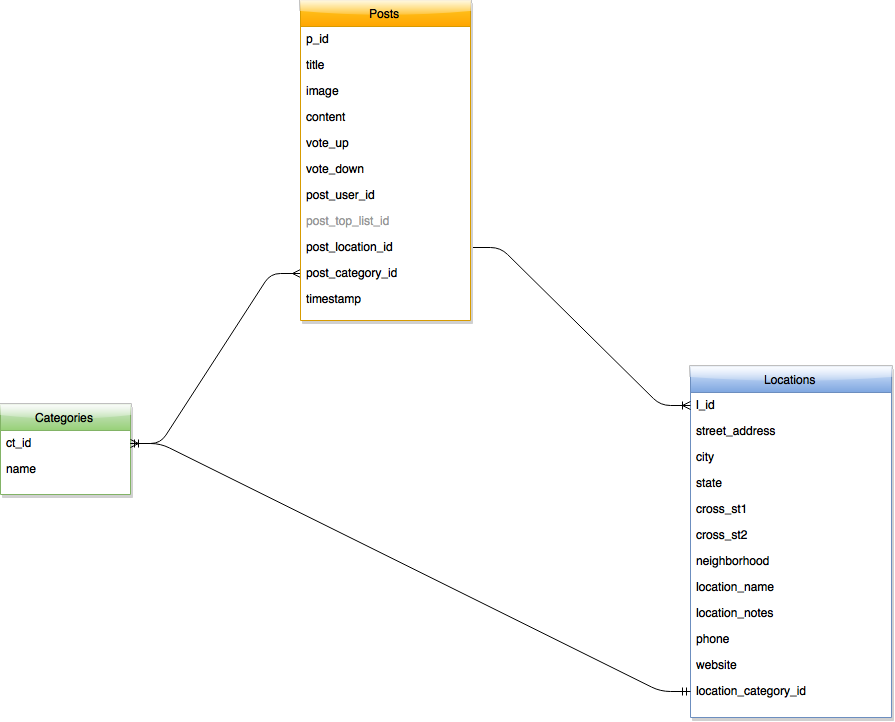

##Application Description

###Website To See Local and Tourist Activities In One Place
Our goal with trekabilly is to create a community website where individuals post tips about their own city and cities they’ve visited. Anyone looking to plan a trip will be able to search for posts by category, keyword, or location and receive results that talk about the whole city, not just the tourist bits. We’ll also integrate voting on posts to engage the community further and do an even better job of giving the most interesting results.

##Team Members
+ Aung Barteaux - Developer
+ Dipshikha Biswas - Developer
+ Bobby Lopez - Developer & Design Expert
+ Anya Melnyk - Developer
+ Dael Jackson - Product Manager
+ *Jason Leibowitz - Dev Mentor*
+ *Ashton O’Connor - UX Mentor*
+ *Heiwad Osman - PM Mentor*

##Technology Used
+ Ruby on Rails
+ Ruby ERB
+ Postgresql - Database
+ Google Maps API
+ HTML & CSS
+ Draw.io - ERD
+ Moqups.com - Wireframes

##Trello Board
<a href="https://trello.com/b/0w01DdZI/ga-lab-bobby-s-angels-team-11" target="_blank">TrekaBilly Trello</a>

##Artifacts for MVP
###Wireframes

###Routes

###ERD

###Tables

####Categories
|ct_id  |category_name  |
|----|----|
|1  |Food and Drink  |
|2  |Sights  |
|3  |Parks  |
|4  |Culture  |
|5  |Other Activities  |

####Posts
|p_id  |title  |image  |content  |vote_up  |vote_down  |post_user_id  |post_location_id  |post_category_id  |timestamp  |
|----|----|----|----|----|----|----|----|----|----|
|1  |Great Seafood at Brooklyn Crab  |http://brooklyn.happeningmag.com/wp-content/uploads/crab.jpg  |There are games on the first floor... |  |  |1  |1  |1  |4/4/2015 13:34:00|
|2  |Brooklyn Crab not for Girls  |http://www.gastrochic.com/t/wp-content/uploads/2014/08/brooklyn-crab-10.jpg  |the amount of bros in this establishment was just ridiculous...  |  |  |1  |1  |1  |4/4/2015 13:35:00|
|3  |Watch Sports at Rose Hill Tavern  |http://s3-media4.fl.yelpcdn.com/bphoto/NCNPJSJ77V4abst58wogGw/ls.jpg  |It's a medium sized... |  |  |1  |2  |1  |4/4/2015 13:36:00|

####Locations
|l_id  |street_address  |city  |state  |cross_st1  |cross_st2  |neighborhood  |location_name  |location_notes  |phone  |website  |location_category_id
|----|----|----|----|----|----|----|----|----|----|----|---|
|1  |24 Reed St  |Brooklyn  |NY  |  |  |  |Brooklyn Crab  |Great Views  |  |  |1  |
|2  |337 3rd ave  |New York  |NY  |  |  |  |Rose Hill Tavern  |Sports Bar  |  |  |1  |
|3  |  |New York  |NY  |E 106th  |Park Ave  |  |Graffiti Wall of Fame  |  |  |  |4  |

##Artifacts for Next Steps
###Wireframes

###Tables

####Users
|u_id  |username  |email  |password  |profile_city  |profile_state  |profile_short  |profile_image  |
|----|----|----|----|----|----|----|----|

####Favorites
|f_id  |fav_user_id  |fav_post_id  |
|----|----|----|

####Comments
|cm_id  |comment_post_id  |comment_user_id  |comment_text  |
|----|----|----|----|
